# Techlab

Techlab is an application made specifically for UPC as the final project for one of its courses. The purpose of this project is to create an app capable of monitoring physical machines, manage users, reservations, permissions, etc.

In this application, you can do the following:
- ## List all the laboratories and machines in the system.

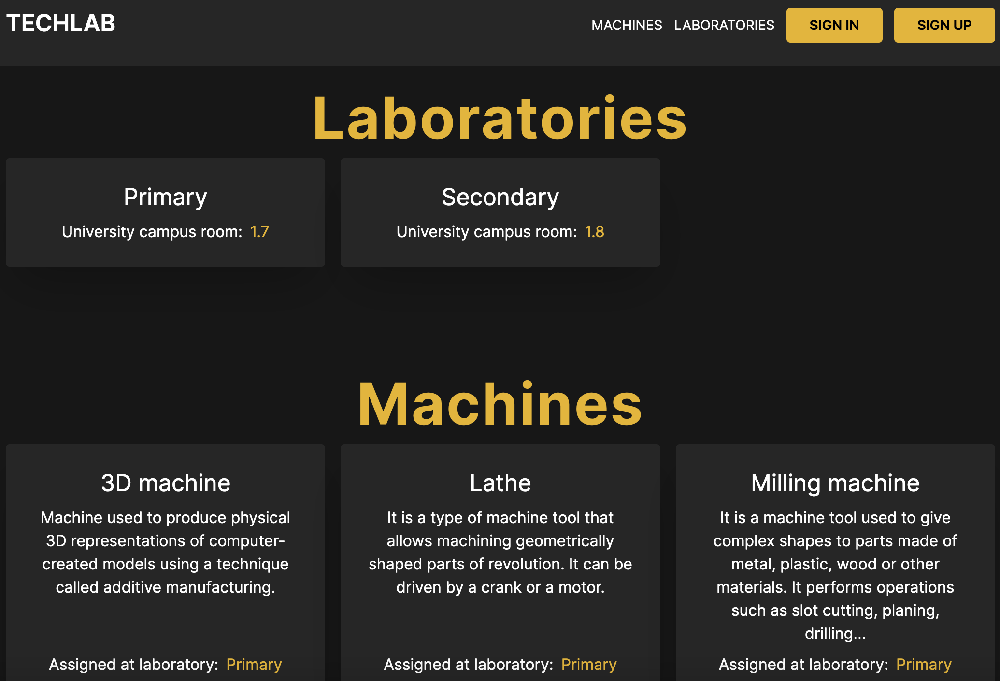

- ## View dashboard and events created by admins.

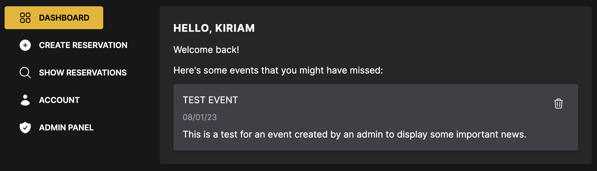

- ## Create reservations for an existing machine.

You can only make a reservation on a future or actual day. If you choose to make a reservation for the actual day, only hours past the current (taking in consideration the user timezone) will be available. If a specific hour for a specific machine is already reserved by another user, it's unavailable to everyone else.

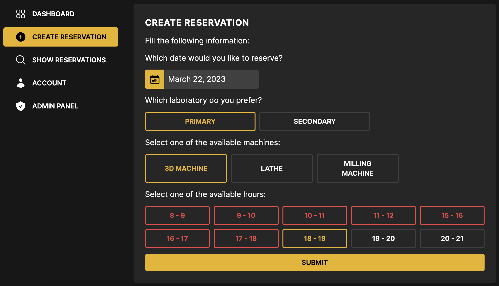

- ## View existing reservations.

If an active reservation is happening right now, you can choose to activate the machine from this view, otherwise the only way to activate the machine is via the RFID card. Users have the ability to delete future reservations in case they don't want to attend them anymore.

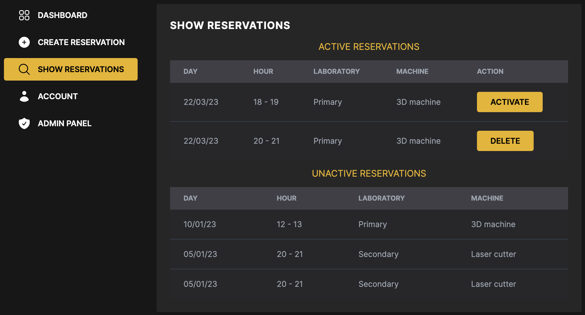

- ## View user information

Check your own information and edit it in case you want to change any of the fields provided.

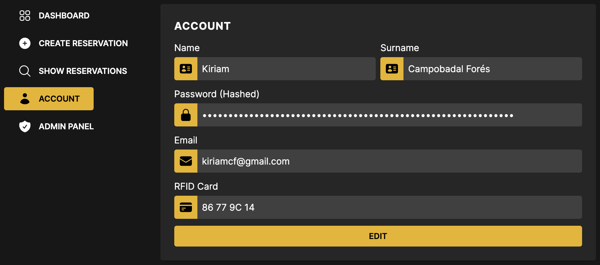

- ## List all admin actions in the admin panel.

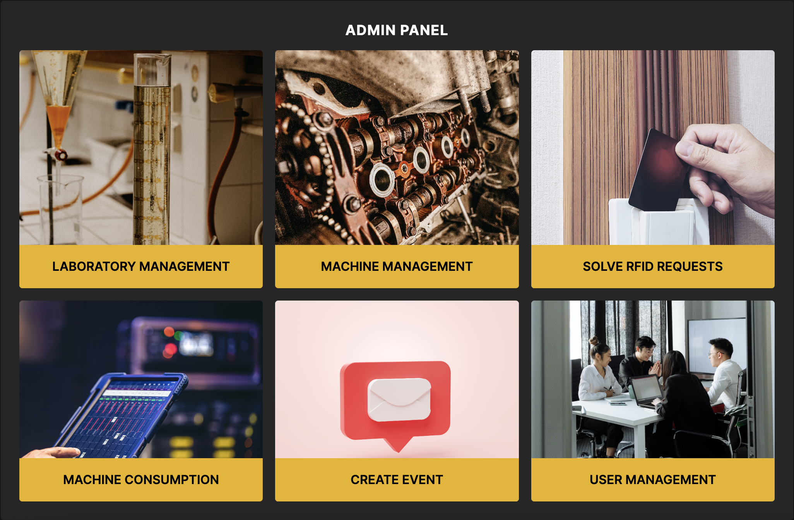

- ## Create / edit laboratories.

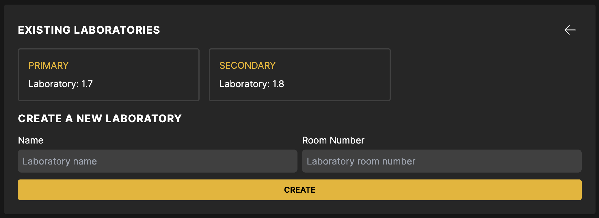

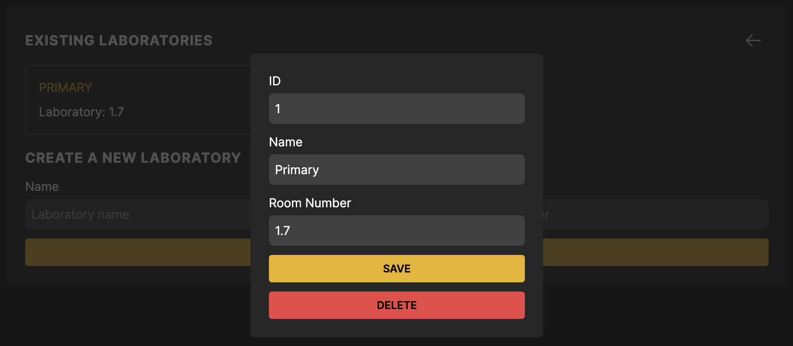

- ## Create / edit machines.

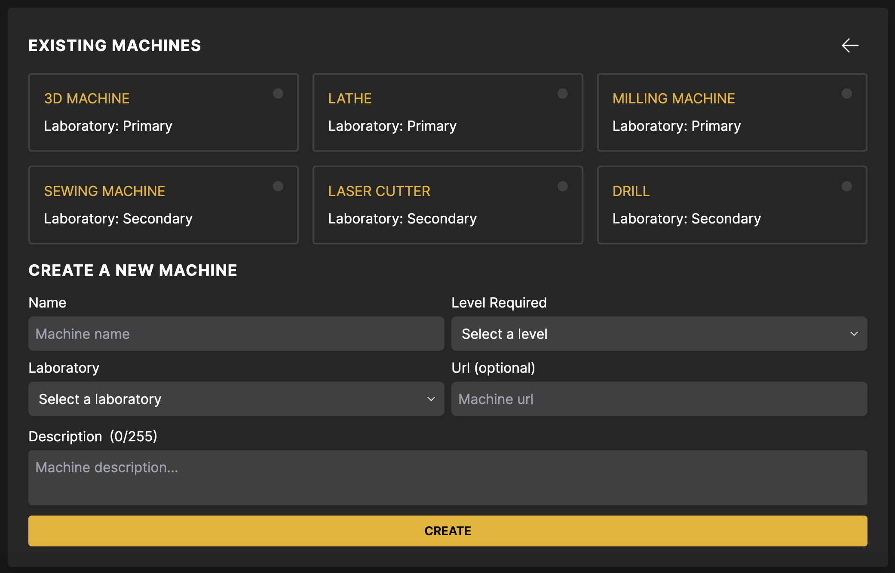

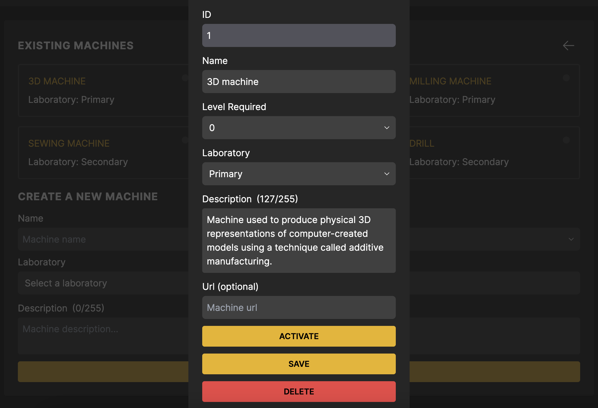

- ## Solve RFID petitions.

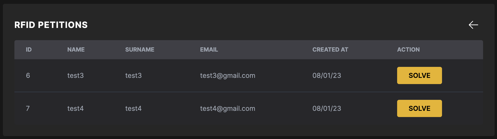

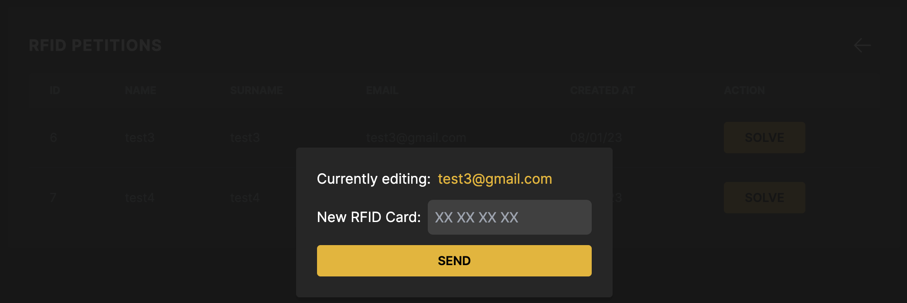

- ## Show machine consumption.

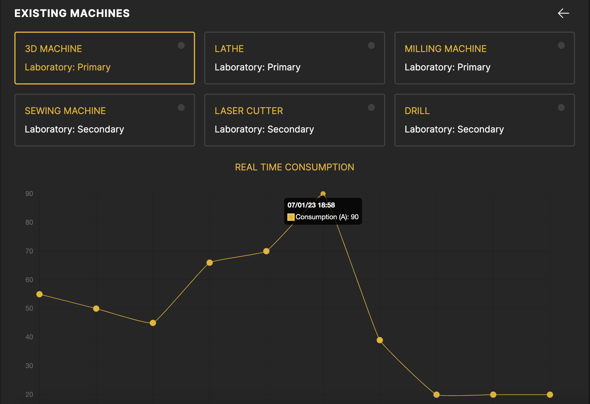

- ## Create events.

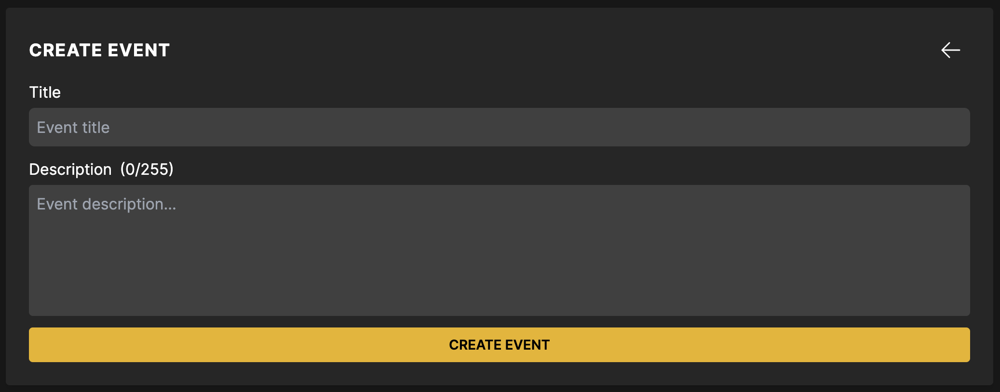

- ## Manage users.

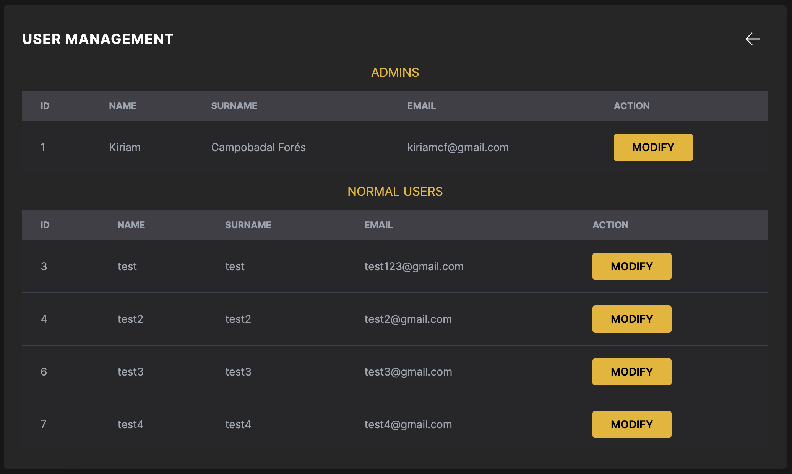

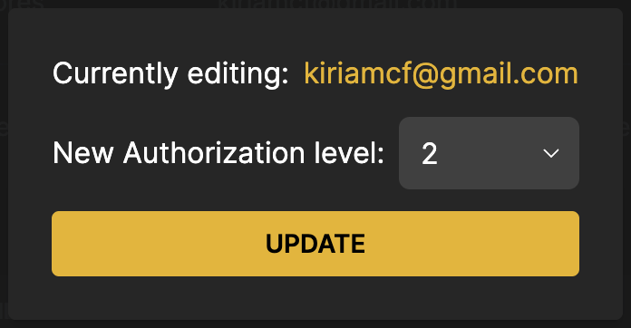

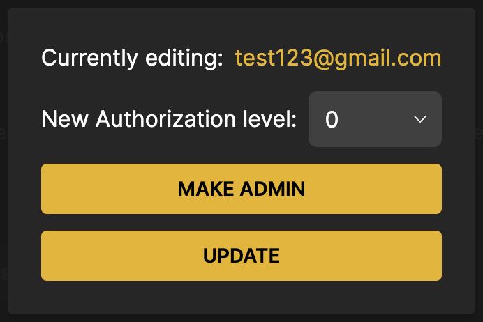

# License

The Laravel framework is open-sourced software licensed under the [MIT license](https://opensource.org/licenses/MIT).
